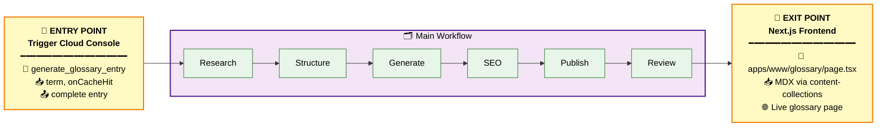

# Marketing Generator

A Trigger.dev-based workflow for automatically generating marketing content, specifically focused on glossary entries (see e.g. [circuit breaker](https://unkey.com/glossary/api-circuit-breaker)). The system uses PlanetScale as its database with Drizzle ORM for data management.

**Table of Contents**
- [1. Running the Glossary Generation Workflow](#1-running-the-glossary-generation-workflow)
  - [Production Environment](#production-environment)
  - [Development vs Production](#development-vs-production)
- [2. Understanding the Workflow](#2-understanding-the-workflow)
  - [Workflow Visualization](#workflow-visualization)
    - [Quick Overview](#quick-overview)
    - [Detailed Workflow](#detailed-workflow)
    - [Architecture Layers](#architecture-layers)
  - [Workflow Steps](#workflow-steps)
- [3. Database Schema](#3-database-schema)
- [4. Available Scripts](#4-available-scripts)
- [5. Dependencies](#5-dependencies)
- [6. Notes](#6-notes)
- [7. Testing](#7-testing)
  - [Trigger.dev](#triggerdev)
    - [Instructions](#instructions)
- [8. Tips for Engineers](#8-tips-for-engineers)
  - [Working with the Workflow](#working-with-the-workflow)
- [9. How to come up with glossary terms](#9-how-to-come-up-with-glossary-terms)

> [!NOTE]
> **Video Walkthrough**
> Check this video walkthrough if you want a guided overview of the workflow
> [Walkthrough](https://procurato.neetorecord.com/watch/56fc81bd8423c43c4bd1)

___

## 1. Running the Glossary Generation Workflow

### Production Environment

The glossary generation workflow runs in Trigger.dev's production environment. To generate a new glossary entry:

1. **Access the Trigger.dev Dashboard**
   - URL: https://cloud.trigger.dev/orgs/unkey-9e78/projects/billing-IzvK/env/prod/test/tasks/generate_glossary_entry?tab=payload
   - This is the production environment where actual glossary entries are generated

2. **Provide the Payload**
   ```json
   {
     "term": "Your Term Here",
     "onCacheHit": "revalidate"
   }
   ```
   - Replace "Your Term Here" with the actual term (e.g., "Facade Pattern", "Retry Pattern", etc.)
   - The `onCacheHit` parameter controls cache behavior:
     - `"revalidate"`: Forces fresh generation even if cached data exists
     - `"stale"`: Uses cached data if available
     - `"bypass"`: Bypasses the cache entirely

3. **Run the Workflow**
   - Click "Run test" button in bottm right
   - The workflow will start executing

### Development vs Production

- **Production (`prod`)**: Where actual glossary entries are generated
- **Test Environment (`test`)**: Used for testing local WIP changes separately from production

## 2. Understanding the Workflow

The main workflow (`_generate-glossary-entry.ts`) orchestrates the generation of glossary entries through a series of sequential and parallel tasks. The workflow is idempotent and can be safely restarted if aborted.

### Workflow Visualization

#### Quick Overview
The glossary generation workflow transforms a term into a published glossary page:



#### Detailed Workflow
Dive deeper into the three-layer architecture:

```mermaid

flowchart LR
    %% Entry point sticky note
    ENTRY["`📌 **ENTRY POINT**
    **Trigger Cloud Console**
    ━━━━━━━━━━━━━━━━━━━━
    🚀 generate_glossary_entry
    📥 term, onCacheHit
    📤 complete entry`"]

    %% Main Workflow as sticky notes
    subgraph WORKFLOW["🗂️ Main Workflow Steps"]
        direction LR
        
        %% Step 1: Research Phase
        S1["`📌 **Step 1: Research**
        ━━━━━━━━━━━━━━━━
        keyword_research
        ⬇️
        technical_research`"]
        
        %% Step 2: Content Structure
        S2["`📌 **Step 2: Structure**
        ━━━━━━━━━━━━━━━━
        generate_outline`"]
        
        %% Step 3: Content Generation
        S3["`📌 **Step 3: Generate**
        ━━━━━━━━━━━━━━━━
        draft_sections
        content_takeaways
        ⚡ parallel`"]
        
        %% Step 4: SEO & Metadata
        S4["`📌 **Step 4: SEO**
        ━━━━━━━━━━━━━━━━
        seo_meta_tags
        generate_faqs`"]
        
        %% Step 5: Publishing
        S5["`📌 **Step 5: Publish**
        ━━━━━━━━━━━━━━━━
        create_pr`"]
        
        %% Step 6: Review
        S6["`📌 **Step 6: Review**
        ━━━━━━━━━━━━━━━━
        PR Review
        Manual QA
        ✅ Merge`"]
        
        S1 --> S2 --> S3 --> S4 --> S5 --> S6
    end
    
    %% Exit point
    EXIT["`📌 **EXIT POINT**
    **Next.js Frontend**
    ━━━━━━━━━━━━━━━━━━━━
    📁 apps/www/glossary/page.tsx
    📥 MDX via content-collections
    🌐 Live glossary page`"]
    
    %% Sub-steps for each main step
    subgraph SUB1["keyword_research   ℹ️ High-level only"]
        direction LR
        KR1[Search Query]
        KR2[Organic Results]
        KR3[Scrape Top 3]
        KR4[Extract Keywords]
        KR1 --> KR2 --> KR3 --> KR4
    end
    
    subgraph SUB2["technical_research"]
        direction LR
        TR1[exa_domain_search ×4]
        TR2[evaluate-search-results]
        TR3[scrape-search-results]
        TR1 --> TR2 --> TR3
    end
    
    subgraph SUB3["generate_outline"]
        direction LR
        GO1[generateInitialOutline]
        GO2[perform_technical_eval]
        GO3[perform_seo_eval]
        GO4[reviseSEOOutline]
        GO5[perform_editorial_eval]
        GO6[reviseEditorialOutline]
        GO7[Save Outline]
        GO1 --> GO2
        GO1 --> GO3 --> GO4 --> GO5 --> GO6 --> GO7
    end
    
    subgraph SUB4["draft_sections"]
        direction LR
        DS1[draftSections]
        DS2["`reviewContent
        (with technical_research)`"]
        DS3["`seoOptimizeContent
        (with keyword_research)`"]
        DS1 --> DS2 --> DS3
    end
    
    subgraph SUB5["content_takeaways"]
        direction LR
        CT0[Fetch Technical Research]
        CT1[Analyze Content]
        CT2[Extract Insights]
        CT0 --> CT1 --> CT2
    end
    
    subgraph SUB6["seo_meta_tags"]
        direction LR
        SEO1[Fetch Keywords]
        SEO2[Get Top 10 Pages]
        SEO3[GPT-4 Craft Tags]
        SEO4[Validate Lengths]
        SEO1 --> SEO2 --> SEO3 --> SEO4
    end
    
    subgraph SUB7["generate_faqs"]
        direction LR
        FAQ1[Get People Also Ask]
        FAQ2[GPT-4 Generate Answers]
        FAQ3[Store FAQs]
        FAQ1 --> FAQ2 --> FAQ3
    end
    
    subgraph SUB8["create_pr"]
        direction LR
        PR1[Check Existing PR]
        PR2[Prepare MDX]
        PR3[Branch Logic]
        PR4[Create/Update PR]
        PR1 --> PR2 --> PR3 --> PR4
    end

    %% Database Layer
    subgraph DATABASE["💾 Database Layer"]
        direction LR
        
        DB_RESEARCH[("`**Research Data**
        • keywords
        • technicalResearch
        • exaScrapedResults`")]
        
        DB_STRUCTURE[("`**Content Structure**
        • sections
        • evaluations`")]
        
        DB_CONTENT[("`**Generated Content**
        • dynamicSectionsContent
        • contentTakeaways`")]
        
        DB_META[("`**SEO & Metadata**
        • metaTitle
        • metaDescription
        • faqs`")]
        
        DB_FINAL[("`**Final Output**
        • githubPrUrl
        • status: completed`")]
    end
    
    %% Connections
    ENTRY --> S1
    S6 --> EXIT
    
    %% Connect main steps to sub-steps
    S1 -.->|expands| SUB1
    S1 -.->|expands| SUB2
    S2 -.->|expands| SUB3
    S3 -.->|expands| SUB4
    S3 -.->|expands| SUB5
    S4 -.->|expands| SUB6
    S4 -.->|expands| SUB7
    S5 -.->|expands| SUB8
    
    %% Workflow to Database connections
    S1 -.->|"stores"| DB_RESEARCH
    S2 -.->|"stores"| DB_STRUCTURE
    S3 -.->|"stores"| DB_CONTENT
    S4 -.->|"stores"| DB_META
    S5 -.->|"stores"| DB_FINAL
    
    %% Database feeds next steps
    DB_RESEARCH -.->|"feeds"| S2
    DB_STRUCTURE -.->|"feeds"| S3
    DB_CONTENT -.->|"feeds"| S4
    DB_META -.->|"feeds"| S5
    DB_FINAL -.->|"feeds"| S6
    
    %% Styles
    classDef stickyNote fill:#fff9c4,stroke:#f57c00,stroke-width:2px,color:#000
    class ENTRY,S1,S2,S3,S4,S5,S6,EXIT stickyNote
    
    classDef database fill:#e1f5fe,stroke:#01579b,stroke-width:2px,color:#000
    class DB_RESEARCH,DB_STRUCTURE,DB_CONTENT,DB_META,DB_FINAL database
    
    classDef container fill:#f5f5f5,stroke:#333,stroke-width:3px,color:#000
    class WORKFLOW,DATABASE container
    
    classDef substep fill:#e8f5e9,stroke:#2e7d32,stroke-width:1px,color:#000
    class SUB1,SUB2,SUB3,SUB4,SUB5,SUB6,SUB7,SUB8 substep

```



#### Architecture Layers

**Layer 1: Main Workflow** (Yellow sticky notes)
- Sequential steps from research to review

**Layer 2: Sub-Tasks** (Green boxes)  
- Trigger.dev tasks that expand each main step
- Vercel AI SDK is used to for LLM calls (drafting, generation & LLM as a judge)

**Layer 3: Database** (Blue cylinders)
- Data persistence between steps
- This is the `marketing` database in PlanetScale
- The schema is defined with Drizzle


### Workflow Steps

Based on the actual execution logs, here's the detailed workflow:

1. **Keyword Research** (`keyword_research`)
   - Performs search queries using the term
   - Fetches organic search results (typically 10 results)
   - Retrieves content from top 3 results using Firecrawl
   - Extracts keywords from titles and headers
   - Example output: 76 keywords for "Retry Pattern"

2. **Technical Research** (`technical_research`)
   - Runs multiple domain-specific searches in parallel:
     - **Official**: Standards bodies (IETF, W3C, ISO)
     - **Community**: Developer sites (StackOverflow, GitHub, Wikipedia)
     - **Neutral**: General technical resources (OWASP, MDN)
     - **Google**: General search results
   - Each search includes API cost tracking (e.g., $0.0115 per search)
   - Evaluates search results using AI to filter relevant content
   - Scrapes selected results for detailed content

3. **Outline Generation** (`generate_outline`)
   - Creates structured content outline
   - Performs technical evaluation (`perform_technical_eval`)
     - Generates accuracy, completeness, and clarity ratings
     - Creates technical recommendations
   - Performs SEO evaluation (`perform_seo_eval`)
     - Similar ratings for SEO aspects
     - SEO-specific recommendations
   - May retry on failure (with backoff delay)

4. **Parallel Processing**
   - Drafts content sections
   - Generates content takeaways
   - Both tasks run concurrently for efficiency

5. **SEO Optimization**
   - Generates meta tags
   - Creates SEO-optimized title and description

6. **FAQ Generation**
   - Creates relevant FAQs for the term
   - Stores in the database

7. **PR Creation**
   - Creates a GitHub PR with the generated content
   - Stores the PR URL in the database

## 3. Database Schema

The system uses PlanetScale with Drizzle ORM. The main `entries` table stores:

- Basic content (title, description, sections)
- SEO metadata
- Technical research
- FAQs
- Content takeaways
- GitHub PR information
- Status tracking
- Timestamps

## 4. Available Scripts

- `dev`: Start development server
- `dev:mcp`: Start development server with MCP support
- `trigger:deploy`: Deploy to Trigger.dev
- `db:push`: Push database schema changes
- `db:studio`: Open database studio
- `db:generate`: Generate database migrations
- `db:migrate`: Run database migrations
- `db:pull`: Pull database schema

## 5. Dependencies

The project uses:
- Trigger.dev v4-beta for workflow orchestration
- PlanetScale for database
- Drizzle ORM for database operations
- Various AI SDKs for content generation
- GitHub integration for PR creation

## 6. Notes

- The workflow is designed to be idempotent
- Each task has a maximum of 5 retry attempts
- Tasks use caching by default but can be forced to revalidate
- The system maintains a comprehensive audit trail of all operations

## 7. Testing

### Trigger.dev

#### Instructions

1. Run the following command in a background terminal:
   ```bash
   pnpm -F generator dev:mcp
   ```
   - **Wait until you see:**
     `Trigger.dev MCP Server is now running on port <PORT>`
   - The default port may be `3333` (as shown in logs)
   - **Example logs for successful operation**

   ```bash
   pnpm -F generator dev:mcp

   > generator@1.0.0 dev:mcp /Users/richardpoelderl/marketing-1/apps/generator 
   > pnpm dlx trigger.dev@v4-beta dev --mcp

   Trigger.dev (4.0.0-v4-beta.21)
   ------------------------------------------------------
   Key: Version | Task | Run
   ------------------------------------------------------
   Trigger.dev MCP Server is now running on port 3333 ✨
   ○ Building background worker…
   │
   ■  Error: (node:9267) [DEP0040] DeprecationWarning: The `punycode` module is deprecated. Please use a userland alternative instead.
   │  (Use `node --trace-deprecation ...` to show where the warning was created)
   │  
   ○ Background worker ready [node] -> 20250613.2 | Test tasks | View runs
   ```
2. Use the trigger.dev MCP to list its tool calls.

Successful operation:

You should see a list of available tasks in the response, similar to this:
```
Parameters:
 No parameters

Result: 

[ 
  "...",
  "...",
  "...",
] 
```


## 8. Tips for Engineers

### Working with the Workflow

1. **Cache Strategy**:
   - Use `"stale"` for development to save on API costs
   - Use `"revalidate"` for production to ensure fresh content
   - Use `"bypass"` when debugging cache-related issues

2. **Monitoring Best Practices**:
   - Check the Trigger.dev dashboard for real-time execution status
   - Look for failed tasks and retry patterns
   - Monitor API costs to optimize usage

3. **Debugging**:
   - Each task has detailed logs with timestamps
   - Check the "exception" events for error details
   - Use task levels to understand execution flow

4. **Performance Optimization**:
   - Parallel tasks (using `batch`) significantly reduce total execution time
   - The technical research phase runs 4 domain searches concurrently
   - Content generation and takeaways run in parallel

5. **Database Considerations**:
   - All data is persisted to PlanetScale
   - Check for existing entries before triggering new generations
   - Use `db:studio` to inspect data directly

6. **Task Dependencies**:
   - `triggerAndWait` ensures dependent tasks complete before proceeding
   - The workflow is designed to be resumable if interrupted
   - Each task stores its output for subsequent tasks to use
  
## 9. How to come up with glossary terms

> [!NOTE]
> **Video Walkthrough**
> Check this video walkthrough if you want a guided overview of the ideation
> [Walkthrough](https://procurato.neetorecord.com/watch/b55f1f7ccecbae6e5a34)


If you have some API development related terms that you think are missing, use them.

Otherwise, this is one way you could come up with ideas:
1. **Gather keyword data.**
    * Go into the search console's [Performance Report](https://search.google.com/search-console/performance/search-analytics?resource_id=sc-domain%3Aunkey.com) and select `Queries`
    * Display 100 keywords on the page
    * Filter out queries containing `unkey`
    * Copy 100 entries
2. **Prompt your LLM of choice.**
    * This could be Claude, ChatGPT or whatever you work with
    * Prompt it to propose 10 technical terms related to API development, drawing inspiration from below keyword data
    * Insert the keyword data from step 1
3. **Cross-check existing glossary entries.**
    * You can [search the marketing repository](https://github.com/search?q=repo%3Aunkeyed%2Fmarketing%20gateway&type=code) for your term to see if an `.mdx` file already exists
4. **🔁 Repeat steps 2 & 3 until you have enough terms.**
5. **Generate the entry.**
    * Test the workflow in [Trigger's Cloud console](https://cloud.trigger.dev/orgs/unkey-9e78/projects/billing-IzvK/env/prod/test/tasks/generate_glossary_entry)

## 10. Troubleshooting

> [!NOTE]
> **Video Walkthrough**
> Check this video walkthrough if you want a guided overview of how to deal with failed runs
> [Walkthrough](https://procurato.neetorecord.com/watch/751a467813c1533e110e)

Given that LLMs generate our outputs, generations may fail.
Since there are lots of sub-tasks running in the workflow, I follow this workflow when encountering failures:
1. Retry the attempt
  * Oftentimes, it's just a matter of trying it 3 times and the workflow might work as the LLMs get it right
2. Identify the erroneous sub-task
  * Identify which sub-task threw the error, to see what's going on
  * I go through the task logs and visually scan for the blue `T` entries to find the `Attempt` that failed
  * On the `Attempt`, you can find more useful error information as it cites the function that threw the error
3. You can optionally update the workflow to make it more resilient

Trigger allows you to define `maxAttempts` for each task. For brittle sub-tasks use a higher value, at least 3.
